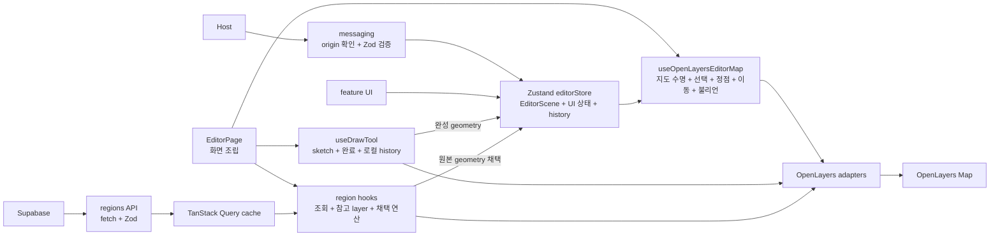
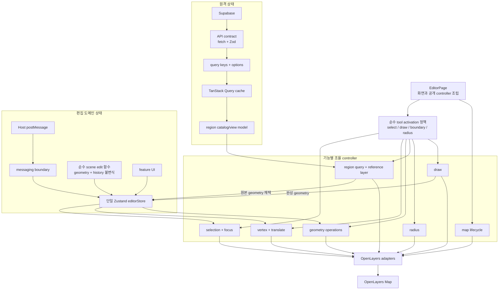

# Editor Architecture Guide

이 문서는 에디터 도메인에서 새 기능을 추가할 때 파일 위치와 책임을 흔들리지 않게 정하기 위한 구조 가이드입니다.
Codex와 Claude는 이 문서를 기준으로 `EditorPage` 비대화, OpenLayers 의존 누수, store 오염을 피합니다.

## 현재 구조와 목표 구조 비교

목표 구조는 기존 설계를 교체하는 재작성안이 아니다. `EditorScene`, Zustand, TanStack Query, OpenLayers adapter라는 기존 경계를 유지하면서, Draw/Radius 같은 기능이 추가돼도 한 hook과 여러 UI 컴포넌트에 책임이 계속 쌓이지 않도록 조율 책임을 더 잘게 나누는 정리안이다. Draw는 별도 controller로 분리됐고 나머지는 점진적으로 정리한다.

### 현재 구조

현재 구조의 핵심 장점은 원격 경계 데이터와 편집 scene이 섞이지 않고, OpenLayers 객체도 store 밖에 머문다는 점이다. 카탈로그 fallback·정렬은 `regions/model`의 공용 정책을 사용한다. 확장 시 부담이 되는 지점은 `useOpenLayersEditorMap`에 여러 상호작용 조율이 집중되고, region query key·로딩 정책이 여러 소비처에 나뉘어 있다는 점이다.

### 목표 구조(점진 적용 중)

| 관점         | 현재                                                  | 목표                                                           | 유지 여부   |
| ------------ | ----------------------------------------------------- | -------------------------------------------------------------- | ----------- |
| 편집 상태    | 단일 Zustand store와 `EditorScene`                    | 동일. 순수 scene 편집 함수만 파일로 분리                       | 유지        |
| 원격 상태    | TanStack Query가 region 데이터를 소유                 | query key/options와 catalog view model을 기능 안에서 통합      | 유지·정리   |
| 지도 조율    | `useOpenLayersEditorMap`에 여러 책임 집중             | 공개 hook은 유지하고 내부 controller를 기능별로 분리           | 점진적 분리 |
| 모드 정책    | `toolActivationModel`에서 활성 플래그 계산            | 모든 controller가 같은 정책을 소비                             | 적용 중     |
| 순수 모델    | 일부 option model이 React 아이콘을 포함               | 식별자·라벨·정책은 model, 아이콘은 component/presentation      | 경계 강화   |
| adapter 핸들 | `setActive`, `sync`, `detach` 조합이 adapter마다 다름 | `detach`는 필수, 필요한 capability만 `setActive`/`sync`로 제공 | 규약 명확화 |
| undo/redo    | `commitSceneEdit`를 통한 한 동작 한 스냅샷            | 동일한 단일 커밋 경계를 유지                                   | 유지        |

### 점진적 변경 원칙

1. Query 결과를 Zustand에 복제하지 않는다. 원격 데이터는 TanStack Query, 편집 결과는 Zustand가 소유한다.
2. `EditorPage`와 `useOpenLayersEditorMap`의 공개 계약은 유지하면서 내부 책임부터 분리한다.
3. store를 여러 독립 store로 쪼개지 않는다. 순수 scene 변환만 추출하고 `commitSceneEdit`의 원자적 history 경계는 유지한다.
4. Draw/Radius controller는 통합된 tool activation 정책을 사용한다.
5. 렌더링 diff/cache 최적화는 실제 병목을 측정한 뒤 적용한다.

## Responsibility Map

- `EditorPage.tsx`: 화면 배치와 진입 hook 호출만 담당한다. 지도, 선택, 정점, 편집 절차를 직접 구현하지 않는다.
- `features/*`: 사용자 기능 단위의 진입점이다. 기능별 `components`, `hooks`, `model`을 이 아래에 둔다.
- `features/*/components`: 해당 기능의 React UI만 둔다. OpenLayers 객체를 직접 다루지 않는다.
- `features/*/hooks`: React lifecycle, ref, store 구독, adapter 호출을 조율한다.
- `features/*/model`: React와 OpenLayers를 모르는 순수 함수만 둔다. 단위 테스트 우선 대상이다.
- `adapters/openlayers`: OpenLayers 객체 생성, 이벤트 attach, geometry/style 변환, layer sync만 둔다.
- `state/editorStore.ts`: 에디터 도메인 상태와 scene 편집 action만 둔다. OpenLayers 객체를 저장하지 않는다.
- `types`: postMessage, scene, layer, feature, enum, validation 공통 타입만 둔다.
- `theme`: 의미 기반 색상/스타일 토큰과 style resolver만 둔다.
- `messaging`: postMessage 수신/송신, origin 검증, payload validation 경계만 둔다.

## Placement Rules

- 새 UI 패널이나 버튼은 먼저 `features/[feature-name]/components`를 검토한다.
- 새 기능의 React 조율 로직은 `features/[feature-name]/hooks`에 둔다.
- 계산만 하는 로직은 `features/[feature-name]/model`에 둔다.
- OpenLayers `Map`, `Layer`, `Feature`, `Interaction`, `Geometry`를 직접 만지는 로직은 `adapters/openlayers`에 둔다.
- 여러 기능에서 공유되는 도메인 타입/enum은 `types`에 둔다.
- 여러 기능·어댑터가 공유하는 순수 도메인 판정(`scene`만 보는 정책: 레이어 선택/편집 가능 여부 등)도 `types`에 둔다. 어댑터는 `features/*`를 import하지 않으므로, 더 하위인 `types`에 둬 의존 방향을 지킨다.
- OpenLayers 의존 공용 유틸(콘텐츠 레이어 순회, geometry 거리 계산 등)은 `adapters/openlayers`의 별도 모듈로 모아 어댑터끼리 재사용한다.
- 여러 기능에서 공유되는 시각 토큰은 `theme`에 둔다.

## Hard Rules

- `EditorPage.tsx`에 지도 초기화, 이벤트 attach, 정점 편집, 선택 동기화 로직을 추가하지 않는다.
- Zustand store에 OpenLayers 객체, DOM node, React ref를 넣지 않는다.
- `features/*/model`에서 React, Zustand, OpenLayers를 import하지 않는다.
- `adapters/openlayers`에서 React hook을 import하지 않는다.
- store의 `scene`은 `EditorScene -> EditorLayer[] -> EditorFeature[]` 구조를 유지한다. 운용은 "1레이어 = 1도형" 평탄 스택이며(입력 = 도형 목록, 정규화가 1:1로 펼침), 패널·순서·잠금 기능은 이 평탄 모델을 전제로 설계한다.
- 부모에게 반환되는 도메인 데이터 변경(geometry·이름·도형 추가/삭제·불리언 연산)은 history에 쌓는다. 선택, 호버, 패널 표시, 레이어 visibility 같은 view/UI 변경은 별도 정책이 없는 한 silent로 둔다.
- scene 스냅샷은 읽기 전용 소비를 기본으로 보고, mutation은 store action 내부 경계에서만 수행한다.
- 다른 상태에서 파생되는 값(예: 모드별 interaction 활성 플래그)은 store에 저장하지 않고 순수 함수로 계산한다(파생 상태 중복 금지).
- 어댑터는 OpenLayers Interaction 클래스를 외부로 직접 노출하지 않고 기능별 핸들로 감싼다. 모든 attach 핸들은 `detach`를 제공하고, 동적 활성화나 재바인딩이 필요할 때만 `setActive` 또는 `sync`를 추가한다.

## Adapter Conventions

`adapters/openlayers`의 이벤트/인터랙션 어댑터는 다음 규약을 따른다.

- **핸들 인터페이스 통일**: 모든 `attach*` 어댑터는 `detach()`를 반환한다. 모드에 따라 수명은 유지한 채 켜고 꺼야 하면 `setActive(active)`를, 대상 컬렉션이나 외부 데이터를 재바인딩해야 하면 `sync(value)`를 추가한다. OpenLayers Interaction 클래스(`Modify`, 향후 `Draw` 등)는 어댑터 내부에 감추고 외부로 직접 노출하지 않는다.
- **구현 형태**: 이벤트를 관찰만 하는(소비·우선순위 제어가 아닌) 어댑터는 클로저 팩토리(`attachX(map, options) -> handle`)로 만든다. `extends ol/interaction/*`(클래스)는 이벤트를 실제로 소비/제어할 때만 쓰고, 그 경우에도 위 핸들로 감싼다.
- **살아있는 상태는 게터로 읽는다**: 부착은 1회지만 핸들러는 이후 여러 번 실행되므로, 변하는 상태는 게터 주입(`getScene`/`getSelectedIds`/`getVertices` = `useEditorStore.getState()`)으로 이벤트 시점에 최신을 읽는다. 고정 설정만 값으로 넘긴다. 어댑터는 store/React를 import하지 않고 주입으로 분리한다.
- **고빈도 이벤트는 어댑터 안에서 흡수한다**: `pointermove` 같은 핫패스는 `requestAnimationFrame`으로 스로틀하고, 값이 바뀔 때만 결과를 React state로 올린다(이벤트마다 `setState` 금지). 일시적 메커니즘 상태(rAF 핸들·픽셀 버퍼·dedupe·활성 비트)는 어댑터 로컬에 둔다.
- **pull/push 경계**: 값은 게터로 "이벤트 시점에 당겨" 읽고, 비활성 전환 같은 부수효과(오버레이 clear·힌트 내림)는 `setActive`/이펙트로 "그 순간 밀어서" 처리한다.
- **모드별 활성화**: "어느 모드에서 무엇을 켜는가"는 순수 모델(`mode -> 활성 플래그`)로 한곳에서 정하고, hook의 `[activeMode]` 이펙트가 그 결과를 어댑터 `setActive`로 적용한다. 어댑터의 `active` 비트는 그 결정을 수행하는 로컬 스위치일 뿐, 정책의 출처가 아니다.

## Current Editor Flow

1. `EditorPage.tsx`가 `useOpenLayersEditorMap`, `useDrawTool`, `useEditorMessaging`, `useEditorHistoryShortcuts`를 호출한다.
2. `messaging`이 postMessage payload를 검증하고 `editorStore`에 scene을 주입한다.
3. `features/map/hooks/useOpenLayersEditorMap.ts`가 store 상태를 구독하고 OpenLayers adapter를 호출한다.
4. `adapters/openlayers`가 scene을 OpenLayers layer/feature/interaction으로 변환하거나 동기화한다.
5. `features/layers` 같은 UI 기능은 store action을 호출하고, map hook이 변경된 상태를 지도에 반영한다.
6. `features/regions`는 외부 RPC 응답을 Zod로 검증한 뒤, `adapters/openlayers`의 별도 참고 레이어에만 표시한다. 사용자가 채택한 원본 geometry만 store action으로 scene에 복사한다.
7. `features/draw`는 OpenLayers sketch를 adapter 안에 유지하고, 완성된 geometry만 `addFeatures`로 scene에 커밋한다.

## Testing Rules

- `features/*/model`의 순수 함수는 unit test를 추가한다.
- OpenLayers 변환/정규화 함수도 가능하면 unit test로 잠근다.
- 지도 인스턴스 유지, postMessage 수신, 실제 canvas 렌더링은 e2e에서 검증한다.
- 리팩터링 PR은 최소 `typecheck`, `lint`, unit test, 필요 시 e2e를 통과해야 한다.
